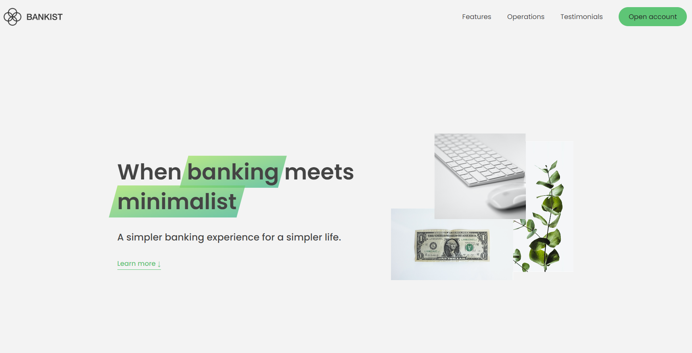

# Bankist Homepage (Practice Project)

This is a practice project led by Jonas Schmedtmann. The purpose of this project is to practice using Intersection Observer API and other modern visual effects used in the industry.

## Description

This is a homepage built for a fictional bank, Bankist. The homepage is not responsive to different screen sizes (yet). It is built with HTML, CSS, and JavaScript. Main features of the homepage are as follows: modal window, smooth scrolling, tabbed component, slider component, lazy loading images, and intersection observer API.

## Getting Started

You can simply open the index.html file in a web browser to run the page and explore!

You can also go to the following link to view the page: https://jyoungjoon.github.io/bankist-homepage/

### Dependencies

* Modern JavaScript features were used in this project. Therefore, it is recommended to use a modern web browser to run the app.

### Installing

* No installation required.
* User can simply open the index.html file in a web browser to run the app.
* User can also go to the following link to view the app: https://jyoungjoon.github.io/bankist-homepage

## Help

* For any issues, please contact the author at https://github.com/jyoungjoon

## Authors

* Jonas Schmedtmann [Twitter](https://twitter.com/jonasschmedtman?lang=en)
* Young Jang [Github](https://github.com/jyoungjoon)

## Version History

* 0.1
    * Initial Release

## License

This project is licensed under the MIT License - see the LICENSE.md file for details

## Acknowledgments

Inspiration, code snippets, starter-code provider, etc.
* Jonas Schmedtmann [Twitter](https://twitter.com/jonasschmedtman?lang=en)
* [awesome-readme](https://github.com/matiassingers/awesome-readme)
* [PurpleBooth](https://gist.github.com/PurpleBooth/109311bb0361f32d87a2)
* [dbader](https://github.com/dbader/readme-template)
* [zenorocha](https://gist.github.com/zenorocha/4526327)
* [fvcproductions](https://gist.github.com/fvcproductions/1bfc2d4aecb01a834b46)
